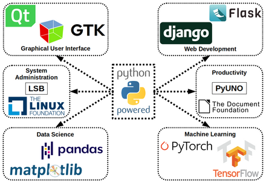

---
aliases:
  - Семинар 2
tags:
  - html
  - css
cssclasses:
---
###### Area links
- [[README|main doc]]
- [[web_tech_intro/readme|Знакомство с web технологиями]]
##### work notes

_______________________________
# classwork

## Упражение 

```html
<!DOCTYPE html>
<html lang="en" dir="ltr">
  <head>
    <meta charset="utf-8">
    <title>Моя первая страница</title>
    <link rel="stylesheet" href="styles/style.css">
  </head>
  <body>
    <h1>Всем привет</h1>
    <h2>Немного обо мне</h2>
    <p>
      Здесь я буду рассказывать о своих достижениях в области изучения
      <b>HTML</b> и <b>CSS</b>
    </p>
    <p>
      Сложно ли учить <b>HTML</b>? Возможно. Но если приложить некоторые
      усилия, то <strong>ничего сложного нет</strong>.
    </p>
    <a href="https://ya.ru">Спросите у яндекса</a>
    <hr>
    
    <p>Картинка с абсолютной ссылкой</p>
    
    <p>Картинка с относительной ссылкой</p>
    <b>Я умею:</b>
      <ul>
        <li>вставлять картинки</li>
        <li>добавлять текст</li>
        <li>добавлять заголовки</li>
      </ul>
    <b>Я хочу:</b>
      <ol>
        <li>На море</li>
        <li>Спать</li>
        <li>Кофе</li>
      </ol>
  </body>
</html>
```

```css
body {
  background-color: #252520;
  color: linen
}
a {
  color: violet
}
```
## Дополнительные материалы

- [Emmet Documentation](https://docs.emmet.io/)  
- [HTML Справочник всех тегов онлайн и примеры](https://html5css.ru/tags/default.php)  
- [Bootstrap 5. Документация на русском языке: Вступление](https://bootstrap-4.ru/docs/5.2/getting-started/introduction/)  
- [Markup Validation Service](https://validator.w3.org/)  
- [РыбаТекст](https://fish-text.ru/)  
- [CSS Справочник примеры и элементы](https://html5css.ru/cssref/default.php)  
- [Bootstrap 4 Учебник Справочник на русском примеры](https://html5css.ru/bootstrap4/default.php)